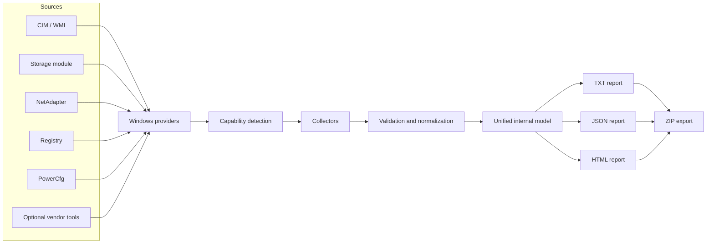

<div align="center">



<br />


<br />

[](https://github.com/TheLouisMahdi/louis-mahdi-system-inspector/releases/latest)
[](https://github.com/TheLouisMahdi/louis-mahdi-system-inspector/releases/latest)
[](#supported-environments)
[](#technology)
[](LICENSE)

[](#privacy-by-design)
[](#privacy-by-design)
[](#privacy-by-design)
[](#portable-single-file-build)

</div>

---

## Download for Windows users

<div align="center">

### No source code or build tools are required for normal use.

[](https://github.com/TheLouisMahdi/louis-mahdi-system-inspector/releases/latest)

</div>

1. Open the [latest GitHub Release](https://github.com/TheLouisMahdi/louis-mahdi-system-inspector/releases/latest).
2. Download `LouisMahdi_System_Inspector.exe` from the **Assets** section.
3. Optionally download the matching `.sha256.txt` file to verify integrity.
4. Run the EXE and choose **Standard** for general use or **Extended** for deeper diagnostics.

> The public Release is the recommended option for ordinary users. The repository source and builder are intended for developers, auditing and custom builds.

> The EXE is currently unsigned. Windows SmartScreen may display an unknown-publisher warning. Verify that the file was downloaded from this repository and compare its SHA-256 checksum before running it.

---

## Overview

**LouisMahdi System Inspector** is a professional, privacy-first Windows inventory application created by **Mahdi — LouisMahdi**.

It collects detailed hardware, firmware, operating-system, storage, graphics, display, battery, security and network information without modifying the computer. The same internal data model produces human-readable and machine-readable reports for troubleshooting, documentation, support and hardware audits.

> **No uploads. No telemetry. No automatic internet requests. No benchmarks. No system changes.**

---

## Why it stands out

<table>
<tr>
<td width="33%" valign="top">
<h3>🔒 Privacy by default</h3>
Sensitive identifiers are redacted or omitted unless the user explicitly enables an unredacted Extended report.
</td>
<td width="33%" valign="top">
<h3>🧠 Source-aware data</h3>
Values retain source, status, confidence and inference metadata instead of hiding uncertainty behind misleading defaults.
</td>
<td width="33%" valign="top">
<h3>🛡️ Read-only operation</h3>
The application does not change the registry, firmware, TPM, Secure Boot, network configuration, drivers or Windows settings.
</td>
</tr>
<tr>
<td width="33%" valign="top">
<h3>🖥️ Broad hardware coverage</h3>
CPU, RAM modules, GPUs, monitors, motherboard, BIOS, TPM, storage, volumes, batteries and network adapters are inspected separately.
</td>
<td width="33%" valign="top">
<h3>📦 Portable reports</h3>
Exports TXT, structured JSON and self-contained HTML, then packages the selected output into a ZIP ready to send.
</td>
<td width="33%" valign="top">
<h3>⚙️ Graceful degradation</h3>
Missing providers, unsupported firmware data and permission limits are reported clearly instead of crashing the whole collection process.
</td>
</tr>
</table>

---

## Core capabilities

- Enumerates **all detected processors, memory modules, graphics adapters, active displays and physical disks**.
- Separates **reported values** from **normalized or inferred values**.
- Preserves exact bytes internally and labels decimal `GB` and binary `GiB` correctly.
- Distinguishes **physical, virtual and disconnected network adapters**.
- Separates **Firmware Mode**, **Secure Boot support**, **Secure Boot state** and **TPM state**.
- Validates network speeds, capacities, percentages, dates, temperatures and provider output.
- Uses optional vendor enrichment such as `nvidia-smi` only when already available.
- Continues collecting other sections when an individual provider fails.
- Supports GUI operation and a scriptable command-line mode.

---

## Report modes

| Capability | Standard | Extended |
|---|:---:|:---:|
| Essential hardware and Windows inventory | ✅ | ✅ |
| Privacy mode enabled by default | ✅ | ✅ |
| TXT, JSON and HTML output | ✅ | ✅ |
| Detailed firmware and security collection | Basic | Expanded |
| Storage reliability and vendor-specific details | Limited | When supported |
| Extended network and partition metadata | — | ✅ |
| Sensitive identifiers | Redacted | Redacted unless explicitly unredacted |
| Recommended use | Sharing and general support | Technical diagnostics and auditing |

> **Extended does not mean unredacted.** Privacy remains enabled until the user explicitly opts out.

---

## Visual architecture



---

## Technology

```text
PowerShell 5.1 / 7.x   Data collection, validation and report generation
Windows Forms          Desktop user interface
C#                     Portable AnyCPU launcher
Batch                  Offline validation and build pipeline
.NET Framework         Native Windows compilation and runtime support
```

---

## Quick start for developers

### Run from source

Double-click:

```text
Run_Source.bat
```

Or run directly:

```powershell
powershell.exe -NoLogo -NoProfile -ExecutionPolicy Bypass -STA -File .\src\LouisMahdi.SystemInspector.ps1
```

### Run the validation suite

```text
Run_Tests.bat
```

The test chain checks syntax, GUI startup contracts, mocked provider behavior, PowerShell 5.1 compatibility boundaries, managed-resource loading and launcher integrity.

---

## Portable single-file build

Double-click:

```text
Build_LouisMahdi_System_Inspector_ONE_FILE.bat
```

The offline builder:

1. Validates PowerShell syntax and application startup contracts.
2. Runs mocked provider tests.
3. Embeds the application source as a managed assembly resource.
4. Stores the expected source SHA-256 inside the launcher.
5. Compiles an AnyCPU Windows executable using the built-in .NET Framework compiler.
6. Runs a launcher self-test.
7. Generates a SHA-256 checksum for the final executable.

Output:

```text
LouisMahdi_System_Inspector.exe
LouisMahdi_System_Inspector.exe.sha256.txt
```

Only the EXE is required for normal distribution. For public users, publish it through [GitHub Releases](https://github.com/TheLouisMahdi/louis-mahdi-system-inspector/releases).

---

## Command-line examples

### Standard report with privacy enabled

```powershell
.\LouisMahdi_System_Inspector.exe --nogui --html
```

### Extended report with privacy retained

```powershell
.\LouisMahdi_System_Inspector.exe --nogui --extended --html
```

### Extended unredacted report

```powershell
.\LouisMahdi_System_Inspector.exe --nogui --extended --unredacted --html
```

### Custom output folder

```powershell
.\LouisMahdi_System_Inspector.exe --nogui --html --output="D:\Reports"
```

### Retain developer diagnostics

```powershell
.\LouisMahdi_System_Inspector.exe --nogui --html --retain-diagnostics
```

### Launcher self-test

```powershell
.\LouisMahdi_System_Inspector.exe --launcher-self-test
```

---

## Generated output

```text
System_Report.txt
System_Report.json
System_Report.html
Developer_Diagnostics.jsonl    optional
System_Report.zip
```

### TXT

Optimized for people: readable sections, explicit unavailable states, source labels, warnings and a professional footer.

### JSON

Optimized for software: stable schema, normalized values, exact raw values, units, source metadata, collection status, confidence, inference flags, warnings and privacy metadata.

### HTML

A self-contained visual report that can be opened in a browser without an internet connection.

---

## Supported environments

### Primary target

- Windows 10 and Windows 11
- Windows Server 2016 or later
- Windows PowerShell 5.1
- Standard-user and administrator execution
- x86 and x64 through the AnyCPU launcher
- Windows 11 ARM64 with .NET Framework 4.8.1
- Laptops, desktops, workstations and virtual machines
- Integrated, dedicated, hybrid and multi-GPU systems
- Single-monitor and multi-monitor systems

### Notes

- GUI mode requires a desktop-capable Windows installation.
- On Server Core, use `--nogui`.
- Optional values may remain unavailable when firmware, drivers, Windows APIs, the current session or permissions do not expose them.
- Windows 7, Windows 8, Windows RT and Nano Server GUI execution are not project targets.

---

## Privacy by design

Privacy mode is enabled by default and redacts or omits:

- Windows username
- Computer UUID
- BIOS and device serial numbers
- Disk, memory, battery and monitor serial numbers
- MAC and IP addresses
- Wi-Fi SSID
- Domain information

The program does not upload reports, contact telemetry endpoints, perform public-IP lookups or install dependencies during normal execution.

See [PRIVACY.md](PRIVACY.md) and [SECURITY.md](SECURITY.md) for the full model.

---

## Reliability principles

- No blank final report fields
- No unsupported values silently converted to zero
- No guessed RAM channel configuration
- No misleading CPU boost-clock claims
- No assumption that WMI GPU memory is universally accurate
- No complete disk-health claim based only on `Status = OK`
- No duplicate network-speed conversion
- No impossible `Mbps`, capacity or percentage output
- No inferred manufacturer presented as directly reported
- No single provider failure terminating the full report

---

## Repository structure

```text
assets/     Branding, icon and animated README artwork
docs/       Architecture, compatibility, priorities and limitations
samples/    Example TXT and JSON reports
src/        Production PowerShell application
tests/      Parser, launcher, startup-contract and mock-provider tests
```

---

## Security note

The generated EXE is currently unsigned. Windows SmartScreen may show an unknown-publisher warning until the application is signed with a trusted code-signing certificate and builds reputation.

---

## Author

<div align="center">

### Developed by **LouisMahdi**

**Mahdi** designed and developed this project as a reliable, privacy-focused Windows inventory tool for real-world support, documentation and diagnostics.

[](https://github.com/TheLouisMahdi)

</div>

---

## License

Released under the [MIT License](LICENSE).

<div align="center">

<sub>Built with PowerShell, WinForms and C# · Developed by LouisMahdi</sub>

</div>
